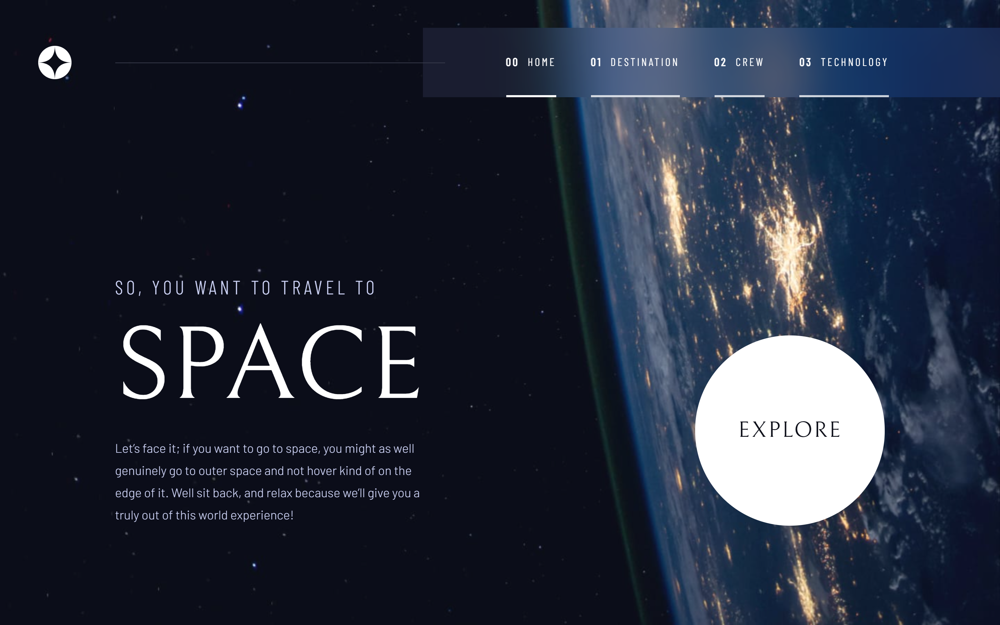

# Frontend Mentor - Space tourism website solution

This is a solution to the [Space tourism website challenge on Frontend Mentor](https://www.frontendmentor.io/challenges/space-tourism-multipage-website-gRWj1URZ3). Frontend Mentor challenges help you improve your coding skills by building realistic projects.

## Table of contents

- [Overview](#overview)
  - [The challenge](#the-challenge)
  - [Screenshot](#screenshot)
  - [Links](#links)
- [How to use](#how-to-use)
- [Built with](#built-with)
- [Author](#author)

## Overview

### The challenge

Users should be able to:

- View the optimal layout for each of the website's pages depending on their device's screen size
- See hover states for all interactive elements on the page
- View each page and be able to toggle between the tabs to see new information

### Screenshot



### Links

- [Solution](https://www.frontendmentor.io/solutions/space-tourism-website-vue-sass-and-pug-Lo66q08J4)
- [Live Site](https://space-tourism-website-b.vercel.app/)

## How To Use

To clone and run this application, you'll need [Git](https://git-scm.com) and [Node.js](https://nodejs.org/en/download/) installed on your computer. From your command line:

```bash
# Clone this repository
$ git clone https://github.com/BrandonSdvl/Space-tourism-website.git

# Install dependencies
$ npm install

# Run server
$ npm run serve
```

## Built with

- Mobile-first workflow
- BEM Methodology
- [VueJS](https://v3.vuejs.org/) - JS Framework
- [Sass](https://sass-lang.com/) - CSS Preprocessor
- [Pug](https://pugjs.org/) - HTML Preprocessor

## Author

- Frontend Mentor - [@BrandonSdvl](https://www.frontendmentor.io/profile/BrandonSdvl)
- Github - [@BrandonSdvl](https://github.com/BrandonSdvl)
